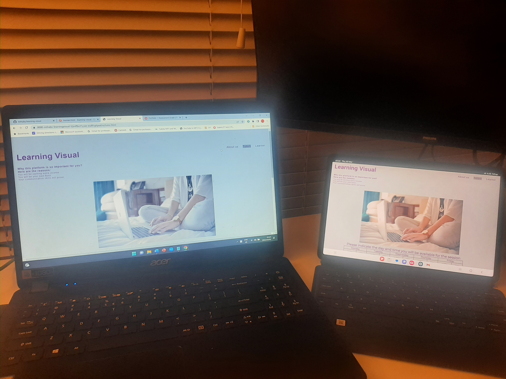

Learning Visual

This is the educational website. It is where learners  will be able to find tutors for their subjects. Learners will be able to get individual attention from an experienced educators who will focus on the skills that needs to be developed and any gaps in their understanding. With regular contact with the tutor, learners will benefit not only for strengthening their academic abilities, but also for ensuring that learning becomes their priority. Tutors who are interested in tutoring will make use of the site as well.

Features

. There are three navigation bar 

- The home page which is the introduction section. This page gives an over view of the webisite. There  
- The tutor page explains the role and the benefits of bieng a tutor.
- learner page details the benefits of enrolling with us.

our service - explains what we are doing and how are we different from others.

subjects - this section list the subjects we are offering and the banefits of doing these subjects.

The footer - this section has the links for social network. the links display on a new tab.

In the tutor page.
. There is a table where the tutor has to indicate the times her/she will be available for the sessions.
. There is also a form that the tutor must fill in for signing up.

In the learner page
. There is a table showing the cost per hour
. The is a form that the learner who wants to enrol with us must fill in.

Testing

I used Validator testing

. For HTML - W3C showed the warnings. there were no errors found.

.For CSS - no errors were found during testing process.

unfixed Bugs -were not fixed because of the time.

Deploying in the Github following these steps:

In the Github repository, click the settings icon. on the pages there is branch. in the branch the drop-down menue has main. select main and the page refresh the link display. 

Credits

For Content, here are the links i used:

1. English - https://www.studiocambridge.co.uk/why-it-is-important-to-learn-english/#:~:text=English%20is%20the%20language%20of,or%20of%20finding%20work%20abroad.
2.programming - https://bootcamp.berkeley.edu/blog/what-is-coding-key-advantages/#:~:text=It%20hones%20problem%2Dsolving%20and,often%20cross%2Ddisciplinary%20and%20collaborative.
3. mathametics - https://www.prodigygame.com/main-en/blog/why-is-math-important/
4. why us - https://collegesofdistinction.com/advice/benefits-of-tutoring/
5.why tutor - https://tutorful.co.uk/blog/4-reasons-you-should-consider-becoming-a-tutor

For media, here is the link i used:

https://www.canva.com/design/DAFbgBJ3jpQ/z_kBbYuPNMIhDFXQdtOOrQ/edit#

