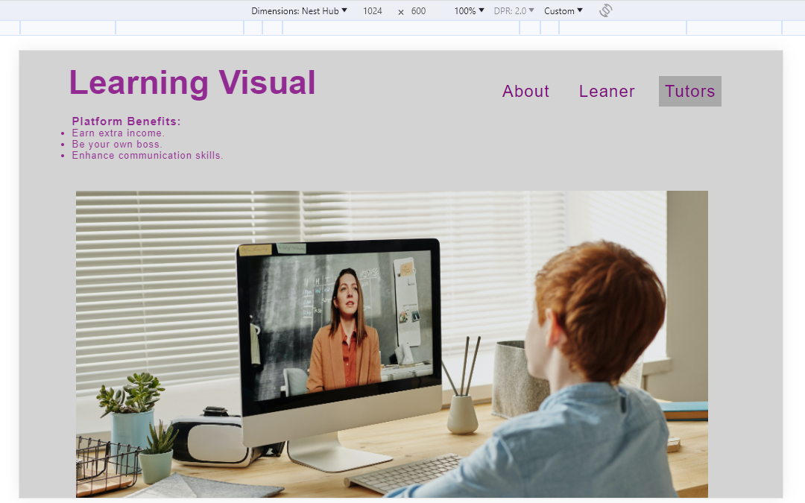
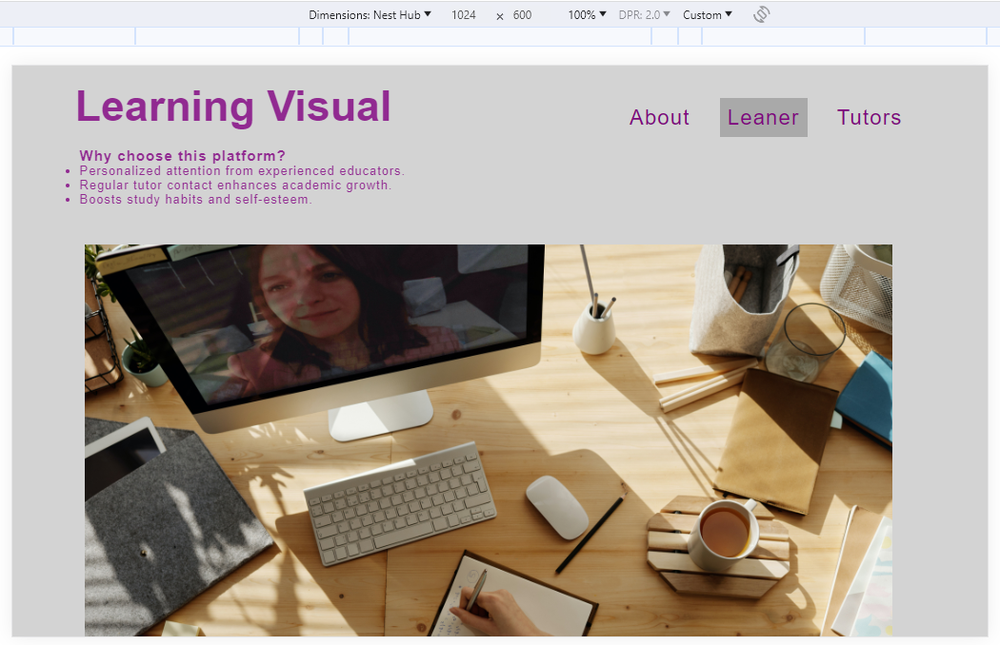
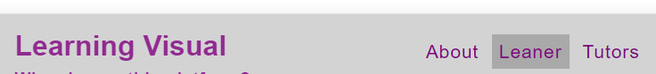
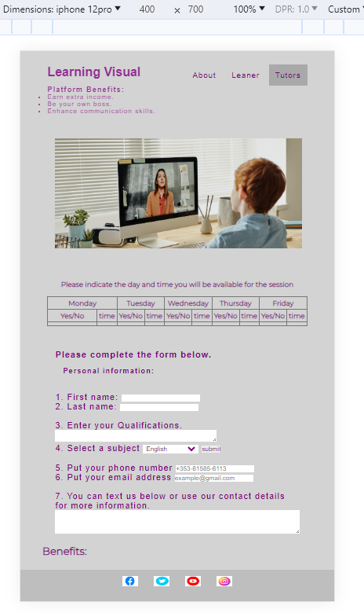
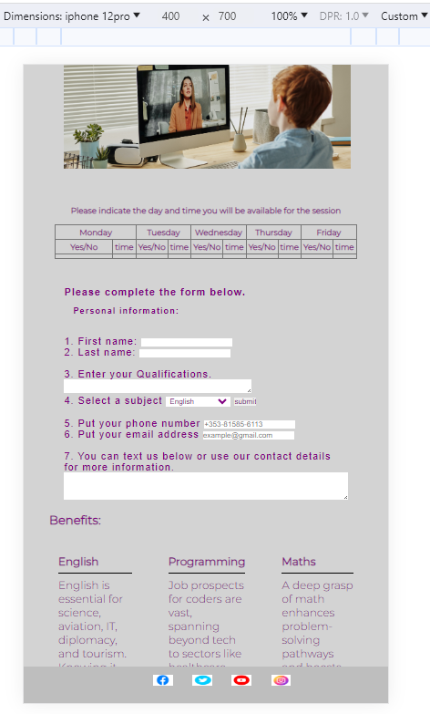
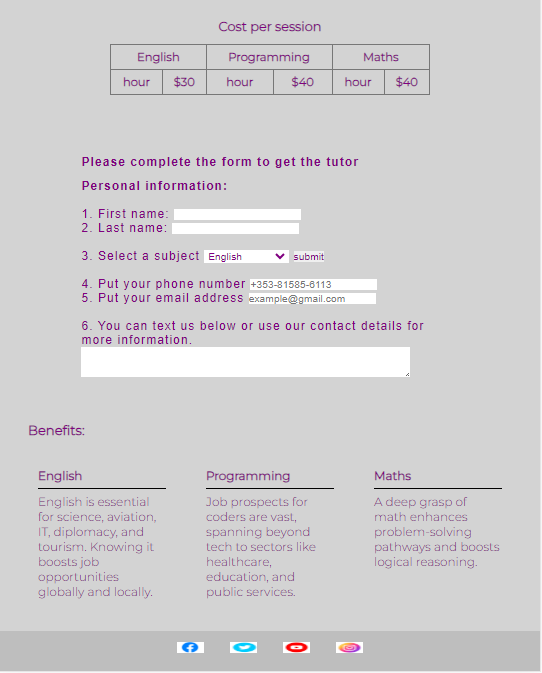
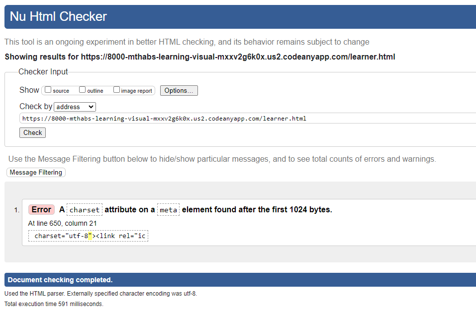
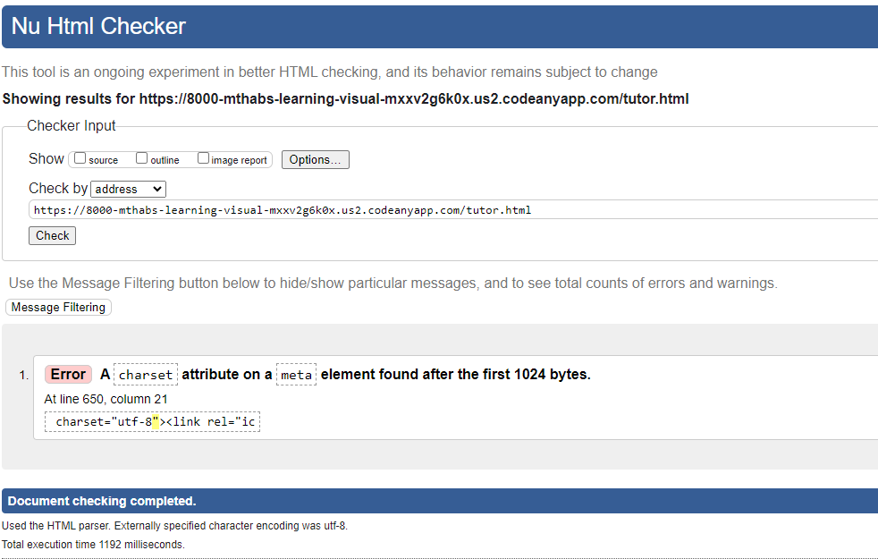
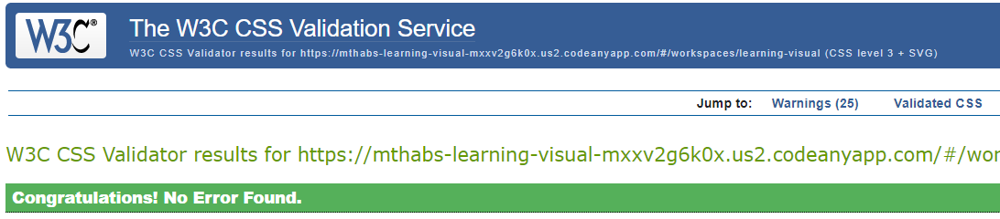

# Learning Visual

**Overview:** Welcome to Learning Visual, the future of online learning. Learning Visual is a learning platform aimed at providing a dynamic and interactive space for tutors and learners. It offers a comprehensive range of educational resources and facilitates virtual tutoring sessions, enabling learners to enhance their skills and knowledge in various subjects. The website is designed to cater to individuals of all ages and educational backgrounds who are seeking effective and engaging learning experiences. We're on a mission to redefine education by providing personalized, top-tier learning experiences. Join us and unlock your full potential with Learning Visual.

## Key Features:

#### Three Navigation Bars

**Home Page:** The introduction section that provides an overview of the entire website.

**Tutor Page:** Explores the role of a tutor and the invaluable benefits of becoming one.

**Learner Page:** Details the advantages and perks of enrolling with Learning Visual.

#### Our Services

- An in-depth explanation of Learning Visual's unique approach and how it distinguishes itself from other educational platforms. We outline our commitment to           personalized learning, flexible schedules, and guaranteed success.

#### Subjects

- A comprehensive list of subjects offered on our platform, accompanied by detailed explanations of the benefits of studying each subject. We highlight how these subjects can enhance career prospects and personal growth.

#### Footer with Social Media Links

- Convenient links to Learning Visual's active social media profiles. These links open in new tabs, ensuring easy access for users to stay connected and engaged with us.

#### Tutor Page:

- **Availability Table:** Tutors can indicate their available times for sessions, providing transparency to potential learners.
- **Sign-Up Form:** A streamlined form for tutors to complete their registration, helping them become part of the Learning Visual community.

#### Learner Page:

- **Cost per Hour Table:** Displays the cost per hour for various subjects, allowing learners to make informed decisions.
- **Enrollment Form:** A user-friendly form for learners who wish to enroll with us. This form collects essential information to help us understand their learning needs.

#### Testing

**Validator testing**

. For HTML - W3C showed only Error: A charset attribute on a meta element found after the first 1024 bytes.

At line 650, column 21

 charset="utf-8"><link rel="ic.

.For CSS - no errors were found during testing process.

#### Unfixed Bugs

- There were no bugs that were detected by the validators, only the warnings were found.

#### Deployment
The site was deployed to GitHub pages. The steps to deploy are as follows:

- In the GitHub repository, navigate to the Settings tab
- From the source section drop-down menu, select the Main Branch
- Once the main branch has been selected, the page will be automatically refreshed with a detailed ribbon display to indicate the successful deployment.
- The live link can be found here - https://mthabs.github.io/learning-visual/

#### Credits

For **Content**, here are the links i used:

1. English - https://www.studiocambridge.co.uk/why-it-is-important-to-learn-english/#:~:text=English%20is%20the%20language%20of,or%20of%20finding%20work%20abroad.
2. programming - https://bootcamp.berkeley.edu/blog/what-is-coding-key-advantages/#:~:text=It%20hones%20problem%2Dsolving%20and,often%20cross%2Ddisciplinary%20and%20collaborative.
3. mathametics - https://www.prodigygame.com/main-en/blog/why-is-math-important/
4. why us - https://collegesofdistinction.com/advice/benefits-of-tutoring/
5. why tutor - https://tutorful.co.uk/blog/4-reasons-you-should-consider-becoming-a-tutor

For **media**, here are the links i used:

- https://www.canva.com/design/DAFbgBJ3jpQ/z_kBbYuPNMIhDFXQdtOOrQ/edit#
- https://www.pexels.com/search/education/

#### Conclusion

- Join Learning Visual today and embark on an educational journey that is personalized, flexible, and backed by a commitment to your success. Learning Visual: Empowering Education.
